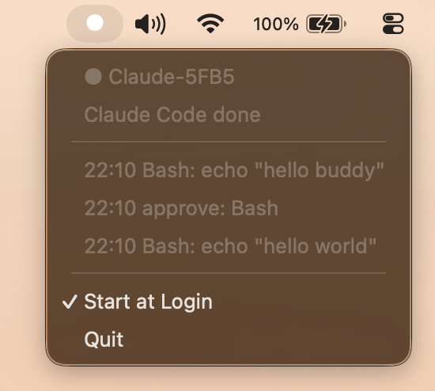

# claude-buddy-bridge

Python host-side bridge for the **[Claude desk buddy](https://github.com/anthropics/claude-desktop-buddy)** — a small BLE device
that shows live Claude Code activity on its display and can optionally gate
tool calls with a hardware button press.

## What it does

**`buddy-app`** is a macOS menu bar app that runs the bridge in the background.



The menu bar icon shows the connection state at a glance:

- `○` — scanning for the device
- `●` — connected
- `⏸` — waiting for hardware approval

The dropdown shows the current tool or status message and a short activity log.
A "Start at Login" toggle installs or removes a LaunchAgent so the app starts
automatically on login.

**`buddy-bridge`** is the underlying daemon (also available as a standalone CLI
if you prefer not to use the menu bar app). It maintains the BLE connection,
sends heartbeats every 5 seconds so the display stays live, syncs the device
clock on connect, and listens on a Unix socket for events from `buddy-hook`.

**`buddy-hook`** is called by Claude Code for every hook event
(`PreToolUse`, `PostToolUse`, `Stop`). It forwards each event to
`buddy-bridge` over the Unix socket and exits immediately. If the bridge is
not running, `buddy-hook` exits 0 so Claude Code is never blocked by a
missing daemon.

## Requirements

- macOS (BLE via CoreBluetooth / `bleak`)
- Python 3.11+
- [uv](https://github.com/astral-sh/uv)

## Installation

From this repository root:

```bash
uv tool install .
```

This installs `buddy-app`, `buddy-bridge`, and `buddy-hook` into your uv tool
bin directory (usually `~/.local/bin`).

## Quick start

**1. Start the menu bar app:**

```bash
buddy-app
```

The icon appears in the menu bar and the bridge starts automatically. Use
**Start at Login** from the menu to have it launch on every login.

Alternatively, run the daemon directly (headless):

```bash
buddy-bridge &
```

**2. Wire up Claude Code hooks** — merge the block below into
`~/.claude/settings.json` (or merge from [`hooks.json`](hooks.json)):

```json
{
  "permissions": {
    "allow": ["Bash(*)", "Read(*)", "Edit(*)"]
  },
  "hooks": {
    "PreToolUse": [
      {
        "matcher": ".*",
        "hooks": [{ "type": "command", "command": "buddy-hook pre-tool" }]
      }
    ],
    "PostToolUse": [
      {
        "matcher": ".*",
        "hooks": [{ "type": "command", "command": "buddy-hook post-tool" }]
      }
    ],
    "Stop": [
      {
        "hooks": [{ "type": "command", "command": "buddy-hook stop" }]
      }
    ]
  }
}
```

## Environment variables

| Variable        | Default   | Description |
| --------------- | --------- | ----------- |
| `BUDDY_TIMEOUT` | `30`      | Seconds to wait for a deny on the device before auto-approving a `PreToolUse`. `0` = display-only mode; the hook never blocks Claude Code. |
| `BUDDY_DEVICE`  | `Claude`  | BLE device name prefix to scan for. |

Example — disable hardware approval (display only):

```bash
BUDDY_TIMEOUT=0 buddy-app
```

## Approval flow

When `BUDDY_TIMEOUT > 0`, `buddy-hook pre-tool` waits up to that many seconds
for a button press on the device before returning. Press **A** (front button)
to approve or **B** (right button) to deny. On timeout the tool is
auto-approved. If the bridge is unreachable, tools are always auto-approved.
The menu bar icon switches to `⏸` while waiting.

## How it works

```
Claude Code
  │  PreToolUse / PostToolUse / Stop
  ▼
buddy-hook          (short-lived process, one per event)
  │  Unix socket  /tmp/buddy-bridge-<uid>.sock
  ▼
buddy-bridge        (long-lived daemon, embedded in buddy-app)
  │  BLE / Nordic UART Service
  ▼
Claude desk buddy
```

The socket is created by `buddy-bridge` and is readable only by the owning
user (`chmod 600`). Messages are newline-terminated JSON.

## Development

```bash
uv sync
uv run buddy-app      # menu bar app
uv run buddy-bridge   # headless daemon
```
